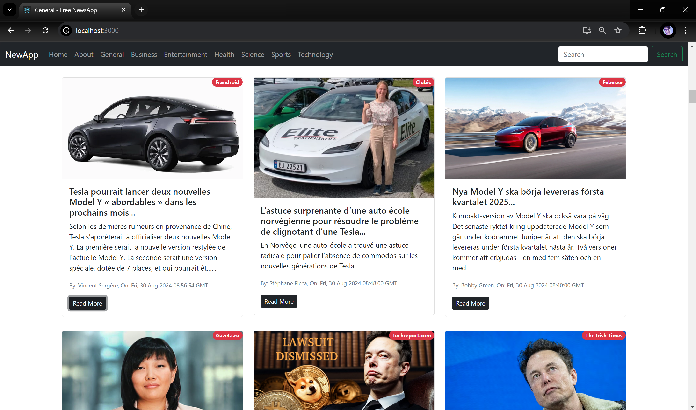
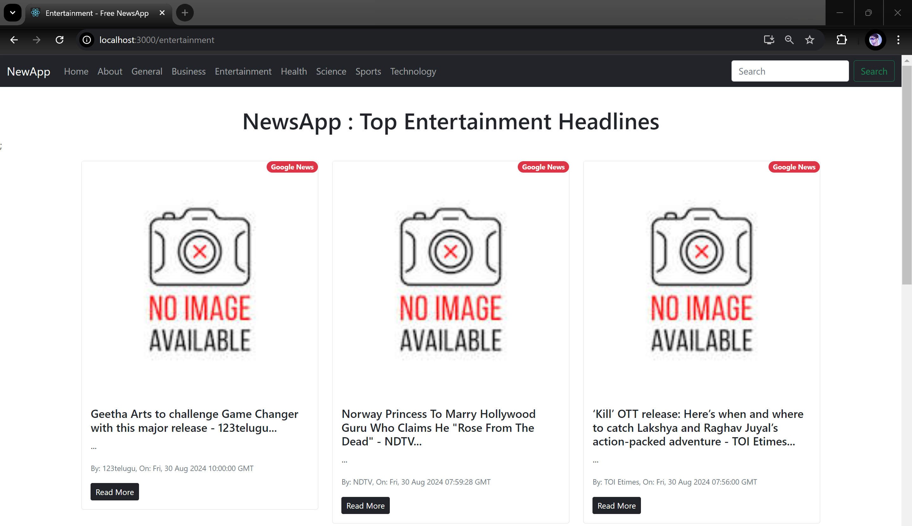

## 📰🗞️ New Web Application [BableshAAzad.com](https://www.bableshaazad.com)
This is a prototype news application built using ReactJS `Class Components`.
 It demonstrates how a news app can function, with data sourced from the `newsapi.org` free API.

---

**🏠 Features:**
- Stay updated with the latest daily news.
- Filter news by categories and topics of your interest.
- Features like Infinite Scroll and a top loading bar for a modern web experience.

---

**🧑‍💻 Technologies Used:**

`ReactJS` `react-router-dom` `react-top-loading-bar` `react-infinite-scroll-component` `Bootstrap 5` `JavaScript` `HTML` `CSS`

---

**💻 How to Use the Source Code:**
1. Download the master branch as a zip file.
2. Import the project into your IDE and ensure Node.js is installed.
3. In the root directory, open a command prompt and run -> `npm install`
4. Visit [newsapi.org](https://newsapi.org) to create your own API key.
5. Create a `.env.local` file and set your API key with `REACT_APP_NEWS_API`= your_api_key
6. Your application is ready to use. Just type in the command prompt -> `npm start`

---

#### 📝 Examples

- **Find Products:**

**Response:**
  ```json
{
  "status": "ok",
  "totalResults": 4747,
  "articles": 
  [
    {
      "source": {
        "id": "newsweek",
        "name": "Newsweek"
      },
      "author": "Billie Schwab Dunn",
      "title": "Famous Kids Who Dropped Celebrity Parent's Last Name",
      "description": "From Suri Cruise to Shiloh Jolie-Pitt, Newsweek has rounded up some celebrity kids who have stopped using a family surname.",
      "url": "https://www.newsweek.com/suri-cruise-shiloh-jolie-pitt-dropped-celebrity-parents-name-1946002",
      "urlToImage": "https://d.newsweek.com/en/full/2460274/angelina-jolie-nicolas-cage-shiloh-jolie.jpg",
      "publishedAt": "2024-08-31T09:00:01Z",
      "content": "While there are many benefits to being a celebrity's child, some wish to keep their famous relative's name at a distance.\r\nNumerous well-known kids have chosen to alter their names, whether it's beca… [+10942 chars]"
    },
    {
      "so on" : "..."
    }
  ]
}
  ```
---

#### 🏠 Home Page 👲

<p align="center">
  
</p>

#### 🧑 Categories 👲

<p align="center">
  
</p>